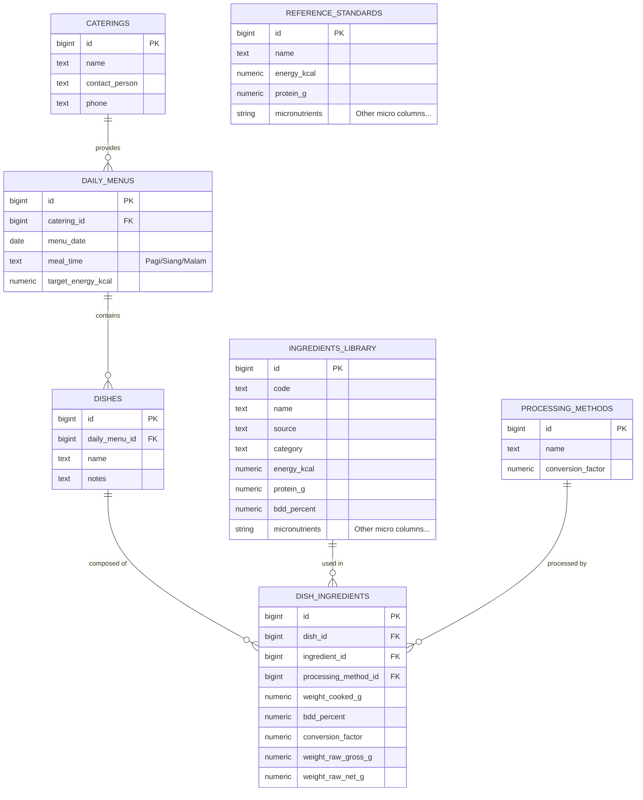

```mermaid
erDiagram
    CATERINGS ||--o{ DAILY_MENUS : "provides"
    DAILY_MENUS ||--o{ DISHES : "contains"
    DISHES ||--o{ DISH_INGREDIENTS : "composed of"
    INGREDIENTS_LIBRARY ||--o{ DISH_INGREDIENTS : "used in"
    PROCESSING_METHODS ||--o{ DISH_INGREDIENTS : "processed by"

    CATERINGS {
        bigint id PK
        text name
        text contact_person
        text phone
    }

    DAILY_MENUS {
        bigint id PK
        bigint catering_id FK
        date menu_date
        text meal_time "Pagi/Siang/Malam"
        numeric target_energy_kcal
    }

    DISHES {
        bigint id PK
        bigint daily_menu_id FK
        text name
        text notes
    }

    DISH_INGREDIENTS {
        bigint id PK
        bigint dish_id FK
        bigint ingredient_id FK
        bigint processing_method_id FK
        numeric weight_cooked_g
        numeric bdd_percent
        numeric conversion_factor
        numeric weight_raw_gross_g
        numeric weight_raw_net_g
    }

    INGREDIENTS_LIBRARY {
        bigint id PK
        text code
        text name
        text source
        text category
        numeric energy_kcal
        numeric protein_g
        numeric bdd_percent
        string micronutrients "Other micro columns..."
    }

    PROCESSING_METHODS {
        bigint id PK
        text name
        numeric conversion_factor
    }

    REFERENCE_STANDARDS {
        bigint id PK
        text name
        numeric energy_kcal
        numeric protein_g
        string micronutrients "Other micro columns..."
    }
```
